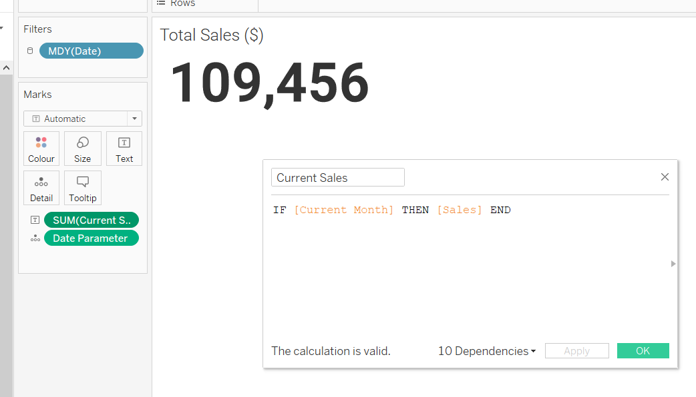
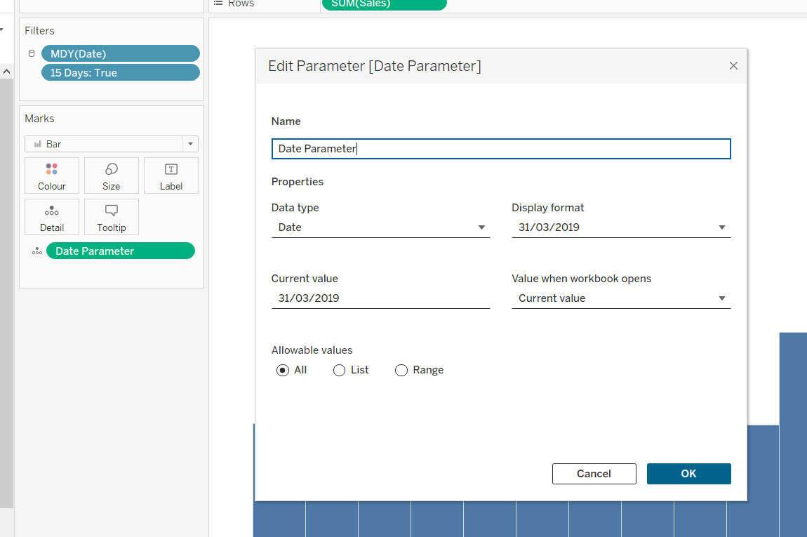
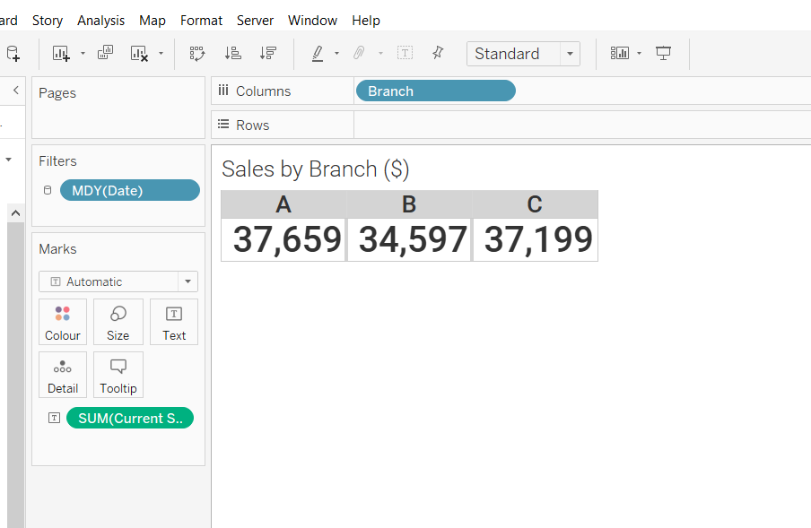
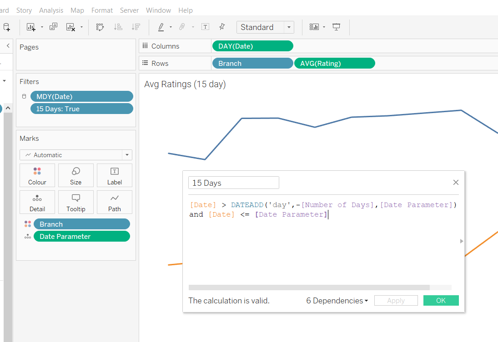
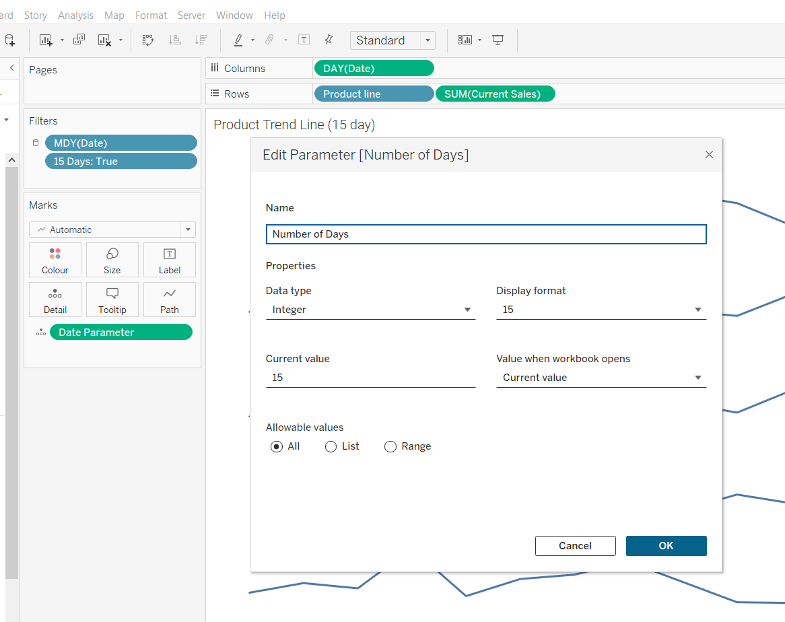
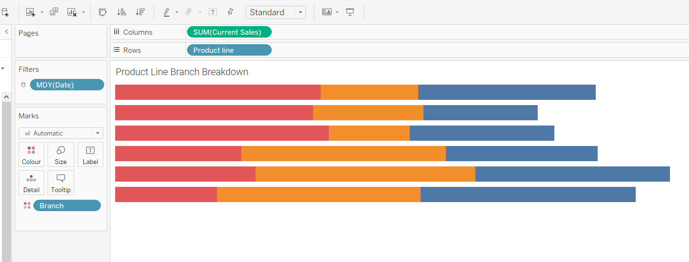
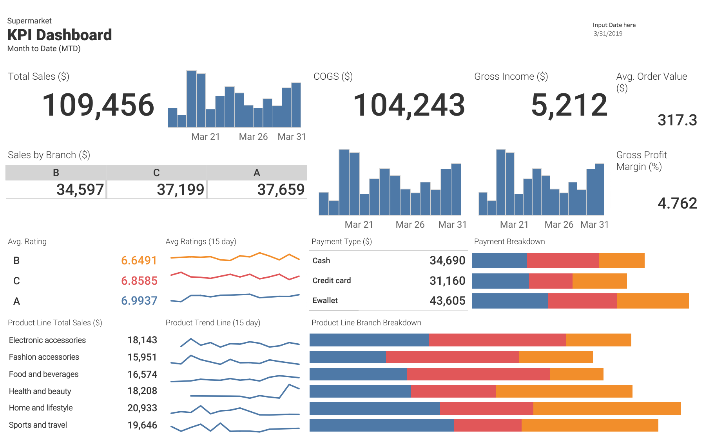

# Supermarket Key Performance Indicator Analysis

## Objective
The objective of this dashboard is to provide comprehensive insights into the supermarket's performance across key areas, prioritizing high-impact KPIs for effective decision-making and strategic planning.

## Business Task
* Monitor total sales across branches
* Track average customer satisfaction rating across branches
* Monitor cost of goods sold, gross income and gross margin percentage
* Identify top-selling product lines
* Identify trends in payment methods and preferences among customers

## Data Source
The dataset, sourced from Kaggle, features historical sales data from a supermarket company, encompassing three different branches over a three-month period. The link to the dataset is provided for reference [here](https://www.kaggle.com/datasets/aungpyaeap/supermarket-sales).

Dataset Info:
Invoice id: Computer generated sales slip invoice identification number
Branch: Branch of supercenter (3 branches are available identified by A, B and C).
City: Location of supercenters
Customer type: Type of customers, recorded by Members for customers using member card and Normal for without member card.
Gender: Gender type of customer
Product line: General item categorization groups - Electronic accessories, Fashion accessories, Food and beverages, Health and beauty, Home and lifestyle, Sports and travel
Unit price: Price of each product in $
Quantity: Number of products purchased by customer
Tax: 5% tax fee for customer buying
Total: Total price including tax
Date: Date of purchase (Record available from January 2019 to March 2019)
Time: Purchase time (10am to 9pm)
Payment: Payment used by customer for purchase (3 methods are available – Cash, Credit card and Ewallet)
COGS: Cost of goods sold
Gross margin percentage: Gross margin percentage
Gross income: Gross income
Rating: Customer stratification rating on their overall shopping experience (On a scale of 1 to 10)

## Process
For this project, I'll be utilizing Tableau to craft a dynamic dashboard tailored for management use. The dashboard will offer comprehensive insights into various Key Performance Indicators (KPIs) crucial for monitoring the business's performance.

1. Implemented a calculated field to determine total sales from the beginning of the selected month up to the latest date.

2. Utilized a parameter to synchronize dates across all sheets, ensuring consistency when aggregating them into a dashboard.

3. Segmented Month-to-Date Sales by the three distinct Supermarket Branches

4. Developed a calculated field to restrict bar and line graphs to a 15-day period, facilitating user-friendly trendline monitoring.

5. Implemented a parameter to specifically constrain the bar and line graphs to display data within a 15-day period.

6. Segmented the month-to-date sales data by product line, then generated a bar chart to further delineate sales of each product line across individual supermarket branches. 

## Dashboard
1. Overall Total Month-to-date Sales
    * Displayed alongside a 15-day bar chart to highlight trends
    * Further breakdown of MTD sales for each supermarket branch
2. Cost of Goods Sold and Gross Profit
    * Provided the overall total COGS and gross profit.
    * Accompanied by corresponding 15-day bar charts for trend analysis.
3. Customer Satisfaction Rating
    * Monitored average monthly customer satisfaction rates per branch.
    * Included a 15-day line chart to identify key trends in customer satisfaction.
4. Average Order Value and Gross Profit Margin
    * Presented the average value of orders per month.
    * Incorporated monitoring of gross profit margin.
5. Product Line Sales Breakdown
    * Detailed breakdown of sales into different product lines for better understanding and decision-making.
6. Payment Method Breakdown
    * Segmentation of sales into each payment method.
    * Further breakdown of payment method sales for each branch.

### Supermarket KPI Dashboard

You can access the dashboard by clicking on the following [link](https://public.tableau.com/app/profile/derrick.adrian.payas/viz/SupermarketsKPIs/Dashboard2#1) on Tableau Public.
